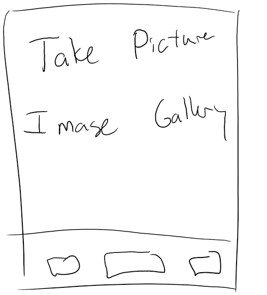
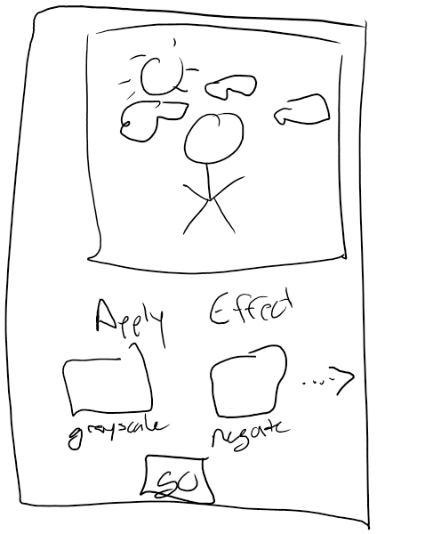

# Project #2: Getting Personal
In this assignment, you must build an application that has at least two views and one or more phone features (e.g. camera, accelerometer, gyroscope, GPS, speaker, etc.).  As always, you are welcome to come up with your own project idea that is equivalent in difficulty, but you must pitch them to me by Thursday, February 1.  Otherwise, you should work to complete what I describe below.

## Application Requirements
For this project, I want you to develop an image manipulation application.  Your program should be able to both manipulate existing phone images or to take new ones that can then be manipulated.  Below is a rough mock of what your first view could look like:

After having obtained an image (either via the camera or through your pone's gallery), your second view should present the image as well as previews for effects that you can apply.  When the user is satisfied, they click a button which then applies the image effect to the selected image and saves it back to the phone.  Again, another quick mockup:

Included in this folder is the most recent writeup from [the first PA in CS 211](./CS211-PA1.pdf).  It explains how to apply a lot of different image effects.  For the purposes of this assignment, you only need to apply the "basic" image manipulations (remove red/green/blue, negate red/green/blue, grayscale, high contrast, add noise).

## Deliverables
This assignment is due on Monday, February 12, 2018 by midnight.  By the due date, you must submit the following:
* Your complete source tree, placed in the "source" directory
* A compiled binary (*.APK file), placed in the "binaries" directory
* [A completed Design Document](./DesignDocument.md)
* [A completed Post Mortem](./PostMortem.md) (due one day later; February 3)

## Grading
Your project will be graded using the following criteria:

### Application Complexity
* Does the application complexity match that of what I have described?  
* Note than an **A** project will go above and beyond the base complexity requirement

### Application Completeness
* Is your application complete?
* Does your application compile?

### Binaries
* Will the supplied APK install and run on an Android 7+ device?

### Source Code Checkins
* Did you use github to regularly check in changes to code?
* Does the checkin history demonstrate consisten progress on the assignment or did you throw everything together in one huge checkin at the last minute?
* Note that an **A** project will demonstrate regular development throughout the project window

### Design Document
* Does the design document clearly articulate the purpose and scope of your project?
* Did you create sufficient scenarios and use cases that give a sufficient description of the project?
* Did you provide system requirements?
* Did you provide a usage manual?

### Post Mortem
* Does your post mortem demostrate metacognitive skills?
