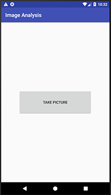
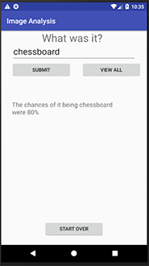

# Image Analysis
This application uses the Google Cloud Vision API to detect the subject of an image. It was created to satisfy the requirements of my CS 480 Mobile Applications course.

## System Design 
This application will run on Android API 23 (Android 6.0, Marshmallow) or above. It uses the camera to take pictures and the internet to communicate with Google. Real-world usage would be for entertainment or to evaluate the Google Cloud Vision API's label detection.
  
## Usage
Start the application and press "Take Picture". You will then be taken to your phone's camera. Take a picture and submit it. The application will then send your request to Google. The application will display its best guess of what the picture is. Choosing "Yes" will celebrate success while choosing "No" will take you to another screen. Choosing "Take new photo" will allow you to retake your photo.

On the next screen you can input what the picture was and the application will evaluate your response. If it guessed your input it will display the percent chance it calculated that the guess was correct. If your input pertains to multiple guesses it will display those.

The other options on this screen are "View All", which will show all of the application's guesses and their percent, and "Start Over", which will return you to the opening screen.
