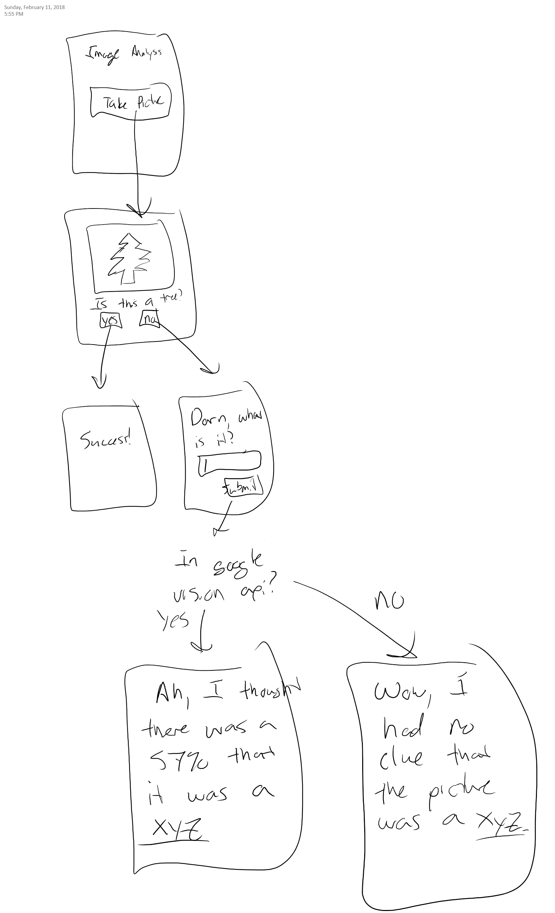

# Project #2: Moar Data
In this assignment, you must build an application that connects to an external web service.  As always, you are welcome to come up with your own project idea that is equivalent in difficulty, but you must pitch them to me by Monday, February 19.  Otherwise, you should work to complete what I describe below.

## Application Requirements
This application builds upon the prior assignment.  I want you to use the Google Vision API to interpret pictures taken by the camera.  Your application should then try to guess what is in the picture.  If the guess is wrong, prompt the user for the correct answer.  If the correct answer is in the Google Vision API's list of possible words, indicate the percent probability.  Otherwise, state that you had no clue.  Below is a diagram that represents expected flow.

## Suggestion for going beyond basic requirements 
This application could easily be turned into a game.  For example, what if you made an &quot;I Spy&quot; type of game in which the user has a certain amount of time to take a picture of a randomly selected word.  Alternatively, what if you prompted the user to draw a picture which the application then had 60 seconds to correctly interpret. 

## Deliverables
This assignment is due on Monday, February 26, 2018 by midnight.  By the due date, you must submit the following:
* Your complete source tree, placed in the "source" directory
* A compiled binary (*.APK file), placed in the "binaries" directory
* [A completed Design Document](./DesignDocument.md)
* [A completed Post Mortem](./PostMortem.md) (due one day later; February 3)

## Grading
Your project will be graded using the following criteria:

### Application Complexity
* Does the application complexity match that of what I have described?  
* Note than an **A** project will go above and beyond the base complexity requirement

### Application Completeness
* Is your application complete?
* Does your application compile?

### Binaries
* Will the supplied APK install and run on an Android 7+ device?

### Source Code Checkins
* Did you use github to regularly check in changes to code?
* Does the checkin history demonstrate consistent progress on the assignment or did you throw everything together in one huge checkin at the last minute?
* Note that an **A** project will demonstrate regular development throughout the project window

### Design Document
* Does the design document clearly articulate the purpose and scope of your project?
* Did you create sufficient scenarios and use cases that give a sufficient description of the project?
* Did you provide system requirements?
* Did you provide a usage manual?

### Post Mortem
* Does your post mortem demonstrate metacognitive skills?
