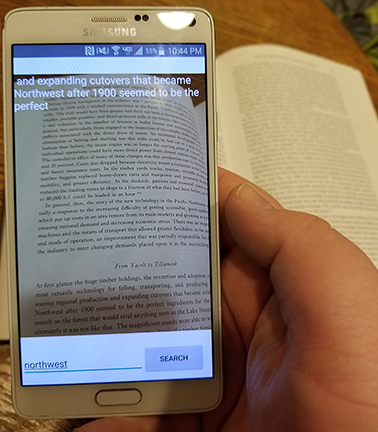

# Text Find
I've had many homework assignments where I had to find information in a book to answer a question. For example, if I had a book about bananas and needed to find the amount of potassium in a banana, I could press ctrl+f to find "potassium" in the document. That would likely lead me to the amount of potassium in a banana, much quicker and more accurately than skimming each page. But if you have an old paper-book you do not have that functionality.

This application was meant to give you that functionality with a paper book.

## System Design 
Requirements:
*Android 4.0.3 Ice Cream Sandwich
*Camera and camera permissions

This application uses the Google Mobile Vision API. This API differs from the Cloud Vision API in that it does not use the internet to get results. This makes it much faster, but less accurate.

When text is detected from the camera stream it will display the text on screen along with up to 36 surrounding characters. These characters are intended to help you locate where the word was found in the text.

## Usage
After you start the application you will have an open camera stream. Type in a word to search for at the bottom and press search. Then aim your camera at text and it will search it for you.

When the text is found it will be shown at the top of the screen along with some surrounding text. This text is meant to help show you where the text is.

If the text was found multiple times the app will do its best to show the closest find.

 